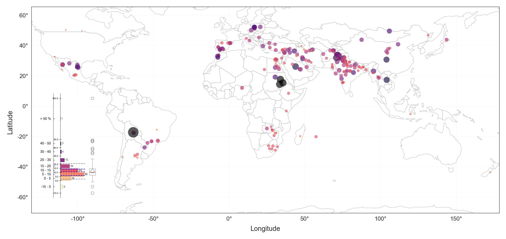

# Wheat Yield at nighttime temperatures 

This repository contains the data and scripts that support the findings of the study.

A Python scripts to support "night temperature determines nearly half of wheat yield variation globally" paper were created and imported into the notebooks in order to help and visualize the results.

Our study, based on field-grown wheat representing most of the spring wheat production regions globally,  demonstrates that increases in nighttime, and not maximum temperatures, have limited the grain yield of wheat. 

To reproduce the results, the folder _data_ constains all of the required raw data and the notebooks "[WheatYield_NightTemperature.ipynb](./WheatYield_NightTemperature.ipynb)" demonstrates the results similar to the final paper.

